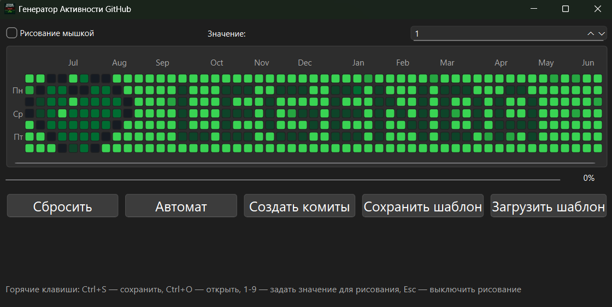
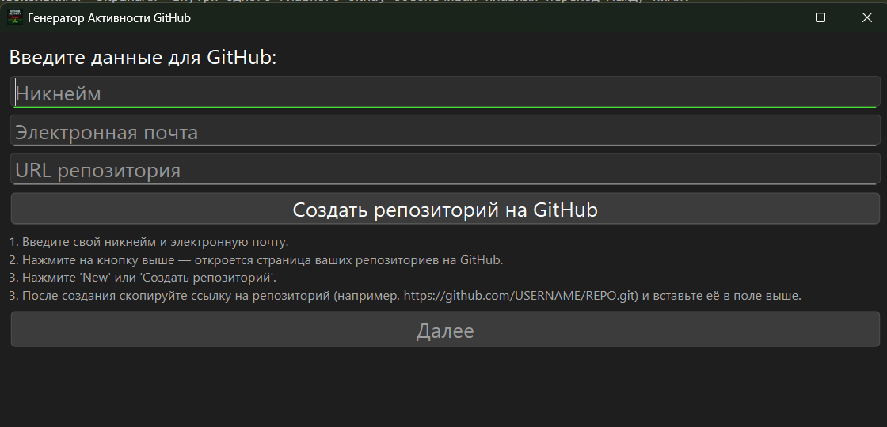
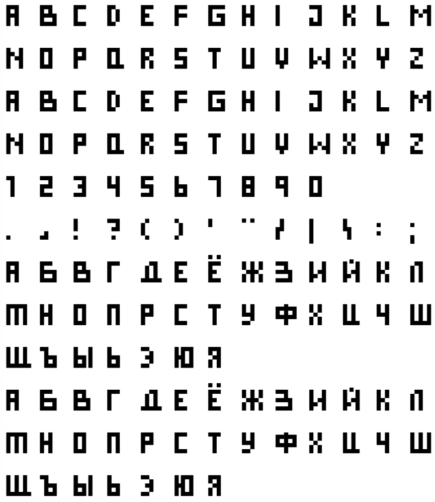

# 🚀 GitHub Activity Generator


Создавайте потрясающие паттерны активности на вашем профиле GitHub легко и быстро! Это десктопное приложение для Windows, разработанное на Python с использованием PyQt6, позволяет генерировать коммиты с пользовательскими датами и количеством, формируя уникальный календарь вкладов.

## ✨ Возможности

*   **Интуитивно понятный интерфейс:** Два удобных экрана для настройки и работы.
*   **Гибкая настройка:** Укажите никнейм, email и URL репозитория.
*   **Календарь активности:** Визуальное редактирование количества коммитов для каждого дня в стиле GitHub.
    
*   **Режим "Рисование мышкой":** Закрашивайте дни в календаре, просто проводя мышкой, для создания уникальных узоров и надписей.
*   **Автоматическое заполнение:** Генерируйте случайное количество коммитов в заданном диапазоне (от 0 до 100) для всего года.
*   **Сохранение и загрузка шаблонов:** Сохраняйте созданные паттерны активности в JSON-файлы и загружайте их позже.
*   **Горячие клавиши:** Ускорьте работу с помощью комбинаций клавиш (Ctrl+S, Ctrl+O, 1-9, Esc).
*   **Проверка Git:** Автоматически проверяет наличие Git на вашей системе.
*   **Отзывчивый прогресс-бар:** Отслеживайте процесс создания коммитов в реальном времени, без зависаний интерфейса.

## 🛠️ Установка и Запуск

1.  **Клонируйте репозиторий:**
    ```bash
    git clone <URL_этого_репозитория>
    cd github-activity-generator
    ```
2.  **Установите зависимости:**
    ```bash
    pip install PyQt6
    ```
3.  **Установите Git:** Если у вас ещё нет Git, скачайте и установите его с [официального сайта](https://git-scm.com/).
4.  **Запустите приложение:**
    ```bash
    python github_activity_new/github_activity_gui.py
    ```

## 🚀 Использование

### Экран 1: Настройка данных GitHub

На первом экране вам необходимо ввести свои учетные данные и указать репозиторий:



1.  **Никнейм:** Ваш никнейм на GitHub.
2.  **Электронная почта:** Email, связанный с вашим аккаунтом GitHub.
3.  **URL репозитория:** Полный URL вашего пустого репозитория (например, `https://github.com/USERNAME/REPO.git`).
    *   **Подсказка:** Если у вас нет репозитория, нажмите кнопку "**Создать репозиторий на GitHub**". Откроется страница ваших репозиториев, где вы сможете создать новый. После создания скопируйте его URL и вставьте в соответствующее поле.
4.  Кнопка "**Далее**" станет активной после заполнения всех полей. Нажмите ее, чтобы перейти к календарю активности.

### Экран 2: Календарь активности и управление коммитами

На втором экране вы увидите интерактивный календарь, похожий на календарь вкладов GitHub.

1.  **Календарь:** Кликайте по дням, чтобы задать количество коммитов. Используйте режим "Рисование мышкой" для быстрого заполнения.
    *   **Значения для рисования:** Введите число в спинбоксе рядом с чекбоксом "Рисование мышкой", чтобы задать количество коммитов для рисования.
    *   **Примеры узоров:** В папке `painting` вы можете найти примеры ASCII-арта для календаря GitHub. Используйте их, чтобы вдохновиться или создать свои!
        
2.  **Кнопки управления:**
    *   **Сбросить:** Очищает весь календарь активности.
    *   **Автомат:** Автоматически заполняет календарь случайными коммитами в выбранном вами диапазоне (от 0 до 100).
    *   **Создать коммиты:** Запускает процесс создания коммитов и их push в указанный репозиторий. Прогресс отображается внизу экрана.
    *   **Сохранить шаблон:** Сохраняет текущий паттерн активности в файл `.json`.
    *   **Загрузить шаблон:** Загружает ранее сохраненный паттерн активности из файла `.json`.

3.  **Горячие клавиши:**
    *   `Ctrl+S`: Сохранить шаблон.
    *   `Ctrl+O`: Загрузить шаблон.
    *   `1-9`: Быстро установить значение для рисования (от 1 до 9).
    *   `Esc`: Выключить режим "Рисование мышкой".

## 📂 Структура Проекта

```
. # Корневая папка проекта
├── github_activity_new/          # Основная папка приложения
│   ├── github_activity_gui.py    # Главный исполняемый файл приложения
│   └── GitHub_activity.ico       # Иконка приложения
├── painting/                     # Папка для сохраненных профилей или примеров (например, ASCII-арт для календаря)
│   └── ...                       # Здесь могут храниться `.json` файлы с шаблонами
├── README.md                     # Этот файл документации
├── screen1.png                   # Скриншот первого экрана
├── screen2.png                   # Скриншот второго экрана
└── pixel-alphabet.png            # Пример ASCII-арта для календаря
```

## ⚙️ Ключевые Особенности и Архитектурные Решения

Проект построен на архитектуре, которая обеспечивает отзывчивость и удобство использования:

*   **Отзывчивый UI с QThread:** Длительные операции (такие как создание и push коммитов) выполняются в отдельном потоке (`CommitWorker`), чтобы основной интерфейс оставался отзывчивым. Прогресс передается через сигналы `pyqtSignal`.
*   **Режим "Drag & Draw" для календаря:** Интуитивно понятная функция рисования по сетке календаря. Пользователь может просто зажать левую кнопку мыши и проводить по дням, чтобы установить количество коммитов.
*   **Многоэкранный интерфейс (QStackedWidget):** Переключение между экранами настройки и календаря реализовано через `QStackedWidget`, что обеспечивает чистый и организованный пользовательский опыт.
*   **Автоматическая проверка Git:** Приложение проверяет наличие установленного Git перед выполнением Git-операций, предоставляя пользователю четкие инструкции в случае его отсутствия.
*   **Надежная обработка ошибок:** Включена специальная обработка ошибок доступа (`PermissionError` / `WinError 5`) при работе с временными файлами Git, что предотвращает сбои и предлагает пользователю решения.

## 📚 Используемые Библиотеки и Фреймворки

*   **PyQt6:** Основной фреймворк для создания GUI-приложения на Python.
*   **`subprocess`:** Стандартная библиотека Python для запуска внешних процессов, используется для выполнения команд Git.
*   **`shutil`:** Стандартная библиотека Python для операций с файлами и папками (например, удаление директорий).
*   **`webbrowser`:** Стандартная библиотека Python для открытия веб-страниц в браузере пользователя.
